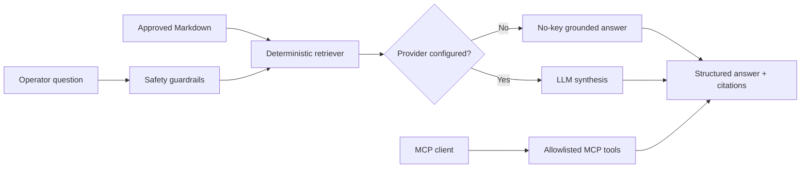

# Data Platform Copilot

[](https://github.com/anveshsvemuri/data-platform-copilot/actions/workflows/ci.yml)

A purpose-built LLM/RAG/MCP portfolio project for safe data-platform operations. It answers questions from approved model cards, data contracts, and runbooks, returns citations, abstains when documentation is insufficient, and exposes controlled tools through the Model Context Protocol.

## Architecture



## Capabilities

- RAG over version-controlled approved documentation
- Citations and explicit abstention when evidence is missing
- Optional OpenAI synthesis with timeout and bounded retries
- Deterministic no-key mode for tests and recruiter demos
- MCP tools for grounded Q&A, approved-source discovery, and safe pipeline status
- Prompt-injection, destructive-SQL, PII, and question-length guardrails
- Pydantic structured output contracts
- Versioned evaluation dataset with groundedness quality gate
- Docker packaging and GitHub Actions CI

## Run

```bash
python -m venv .venv
source .venv/bin/activate
pip install -e '.[dev]'
data-copilot "What is the churn model promotion threshold?"
data-copilot --evaluate evals/groundedness.json
data-copilot-mcp
```

The MCP server uses stdio and exposes `ask_platform`, `list_approved_sources`, and `get_pipeline_status`. Configure an MCP client to launch `data-copilot-mcp` from the repository root.

## Security and responsible AI

Only version-controlled Markdown is indexed. Raw customer data and PII are excluded. Tool access is allowlisted and read-only. Retrieved text is treated as untrusted context, answers cite evidence, and unsupported questions receive an abstention. See `.env.example`; never commit API keys.

## Evaluation

The committed dataset verifies source selection, abstention, and safety behavior without calling an external LLM. Production extensions should add provider-specific groundedness scoring, trace export, token/cost/latency dashboards, semantic caching, and human review sampling.

