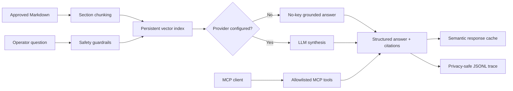

# Data Platform Copilot

[](https://github.com/anveshsvemuri/data-platform-copilot/actions/workflows/ci.yml)

A purpose-built LLM/RAG/MCP portfolio project for safe data-platform operations. It answers questions from approved model cards, data contracts, and runbooks, returns citations, abstains when documentation is insufficient, and exposes controlled tools through the Model Context Protocol.

## Architecture


```mermaid
flowchart LR
    A[Approved Markdown] --> B[Section chunking]
    B --> V[Persistent vector index]
    Q[Operator question] --> C[Safety guardrails]
    C --> V
    V --> D{Provider configured?}
    D -->|No| E[No-key grounded answer]
    D -->|Yes| F[LLM synthesis]
    E --> G[Structured answer + citations]
    F --> G
    G --> K[Semantic response cache]
    G --> T[Privacy-safe JSONL trace]
    M[MCP client] --> H[Allowlisted MCP tools]
    H --> G
```

## Capabilities

- RAG over version-controlled approved documentation
- Section-aware chunks with stable IDs, metadata, and deterministic vectors
- Atomic persistent index with document-fingerprint freshness validation
- Citations and explicit abstention when evidence is missing
- Optional OpenAI synthesis with timeout and bounded retries
- Deterministic no-key mode for tests and recruiter demos
- MCP tools for grounded Q&A, approved-source discovery, and safe pipeline status
- Prompt-injection, destructive-SQL, PII, and question-length guardrails
- Pydantic structured output contracts
- Versioned groundedness, hallucination, and adversarial quality gates
- Privacy-safe traces for latency, token usage, cost, model, and prompt version
- Aggregate observability reports with latency and groundedness alert gates
- Persistent semantic response cache with document and prompt invalidation
- Docker packaging and GitHub Actions CI

## Run

```bash
python -m venv .venv
source .venv/bin/activate
pip install -e '.[dev]'
data-copilot "What is the churn model promotion threshold?"
data-copilot --index .cache/knowledge-index.json --build-index
data-copilot --index .cache/knowledge-index.json "How do I recover a failed pipeline?"
data-copilot --index .cache/knowledge-index.json --cache .cache/responses.json "How do I recover a failed pipeline?"
data-copilot --evaluate evals/groundedness.json
data-copilot --evaluate evals/adversarial.json --minimum-pass-rate 1.0
data-copilot --summarize-traces .cache/traces.jsonl --report-output .cache/observability.json --minimum-grounded-rate 0.80 --maximum-p95-latency-ms 3000 --fail-on-alert
data-copilot-mcp
```

The MCP server uses stdio and exposes `ask_platform`, `list_approved_sources`, and `get_pipeline_status`. Configure an MCP client to launch `data-copilot-mcp` from the repository root. Set `RETRIEVAL_INDEX=.cache/knowledge-index.json` to load the validated persistent index; otherwise the same deterministic chunks are built in memory.

## Observability

Set `COPILOT_TRACE_PATH=.cache/traces.jsonl` to append one structured event for every
completed answer. Events include a random event ID, timestamp, SHA-256 question hash,
prompt version, mode, model, groundedness, citation count, latency, and token usage.
Questions, answers, retrieved passages, API keys, and customer data are never logged.

No model pricing is hard-coded. Set `OPENAI_INPUT_COST_PER_MILLION` and
`OPENAI_OUTPUT_COST_PER_MILLION` when cost reporting is required; otherwise cost is
recorded as `null`. Deterministic mode uses a documented character-based token
estimate, while OpenAI mode records the provider's returned usage counts.

Convert traces into a privacy-safe operational report with `--summarize-traces`.
Reports aggregate event volume, mode/model/prompt-version counts, grounded and cache-hit
rates, p50/p95/max latency, token usage, and configured-cost coverage. They never include
event IDs, question hashes, prompts, answers, citations, or retrieved content. Optional
groundedness and p95-latency thresholds produce a machine-readable alert status;
`--fail-on-alert` exits with status 2 for scheduled quality gates. Report files are
written atomically with owner-only permissions.

## Semantic caching

Pass `--cache .cache/responses.json` or set `COPILOT_CACHE_PATH` to reuse grounded
answers for semantically similar questions. Entries use hashed feature vectors and
SHA-256 question fingerprints rather than raw questions. Cache hits require the same
knowledge fingerprint, prompt version, and provider/model, expire after 24 hours, and
are capped at 500 entries. The cache is written atomically with owner-only permissions;
traces identify cache hits and record zero provider tokens for reused answers.

## Security and responsible AI

Only version-controlled Markdown is indexed. Raw customer data and PII are excluded. Tool access is allowlisted and read-only. Retrieved text is treated as untrusted context, answers cite evidence, and unsupported questions receive an abstention. See `.env.example`; never commit API keys.

## Evaluation

The committed evaluation suites verify source selection, required facts, forbidden claims,
citation support, abstention, prompt-injection resistance, destructive-query blocking, and
PII-exfiltration rejection without calling an external LLM. Every case has a stable ID,
and failure reports contain only IDs and failed checks—not questions or answers. CI requires
a 100% pass rate for both suites, so a safety or hallucination regression blocks the build.

Production extensions should add provider-specific judge scoring, managed dashboard export,
and human-review sampling.
